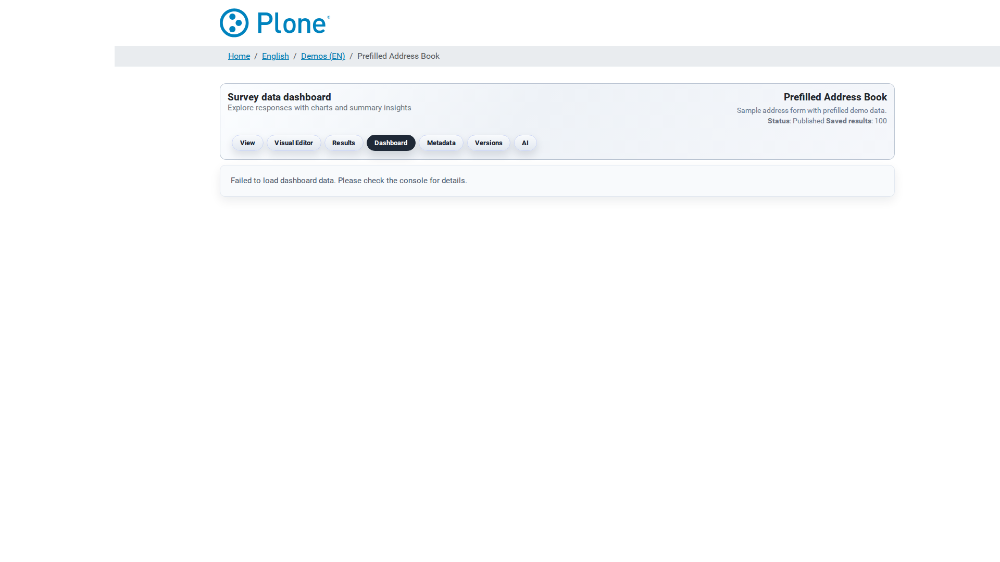

=============
For End Users
=============

This track is for people who build and run surveys day to day using the UI.

Quick start
===========

1. **Create a survey** — in the forms overview use the add action and
   follow the creation wizard (``@@survey-add``): give the survey a title,
   choose the languages and the basic settings. The survey appears in the
   forms overview (``@@pfs``).

   .. image:: _static/screenshots/psf-survey-overview.png
      :align: center
      :alt: Forms overview listing the surveys

2. **Design the form** — open the survey and start the **editor**
   (``@@editor``). The SurveyJS Creator lets you drag question types onto
   the page, configure validation, layout and logic, and preview the result
   — everything is saved as JSON automatically.

   .. image:: _static/screenshots/survey-editor.png
      :align: center
      :alt: SurveyJS Creator editor

3. **Configure the survey** — in the survey's edit form set the actions
   (store, mail, notifications, POST — see :doc:`actions`), the form
   settings (validation, payload limit, access mode) and, if needed, the
   mail settings and embedding options (see :doc:`survey-options`).

4. **Publish and share** — make the survey visible to its audience and
   distribute the survey URL (``@@viewer``). For restricted surveys,
   generate trusted access links (see :doc:`security`); for external
   sites, see :doc:`embedding`.

   .. image:: _static/screenshots/survey-viewer.png
      :align: center
      :alt: Public survey viewer

5. **Review the results** — open ``@@results`` to search, inspect and
   export the submissions; use the dashboard for an overview
   (see :doc:`exports`).

   .. image:: _static/screenshots/survey-results.png
      :align: center
      :alt: Results listing

Everyday tasks
==============

* **Generate a form with AI** — describe the form in natural language in
  ``@@ai``, refine the draft in a chat loop and save it as a form version
  (see :doc:`ai`).

  .. image:: _static/screenshots/survey-ai-generator.png
     :align: center
     :alt: AI generator

* **Manage form versions** — every save creates a new version; preview,
  restore, lock or download versions in ``@@form-versions``.
* **Ask the chatbot** — questions about SurveyJS and the current survey are
  answered by ``@@chatbot`` (see :doc:`chatbot`).
* **Start from a template** — reuse a prepared form structure
  (see :doc:`templates`).

The interface at a glance
=========================

The whole UI is organized around two levels: the **forms overview** for
managing surveys, and the **survey screens** that hang off each survey
(editing, results, AI, versions, …). This section walks through every view
and its sections; each screen links to the detailed documentation.

Forms overview (``@@pfs``)
--------------------------

The entry point for building and managing forms: lists all surveys and
templates, with quick access to add new surveys and open existing ones.

.. image:: _static/screenshots/psf-survey-overview.png
   :align: center
   :alt: Forms overview

Survey landing page (``@@view-main``)
-------------------------------------

Every survey has a landing page with navigation to the survey tools
(viewer, editor, results, settings, …) — the hub for working with a single
survey.

.. image:: _static/screenshots/survey-view-main.png
   :align: center
   :alt: Survey landing page

Public viewer (``@@viewer``)
----------------------------

The public face of the survey: renders the form for visitors, handles the
submission and applies the survey's access mode and token protection. The
same view is used for anonymous visitors and logged-in submitters.

.. image:: _static/screenshots/survey-viewer.png
   :align: center
   :alt: Public survey viewer

.. image:: _static/screenshots/survey-viewer-anonymous.png
   :align: center
   :alt: Public survey viewer as seen by an anonymous visitor

Editor (``@@editor``)
---------------------

The SurveyJS Creator visual editor: drag question types onto the page,
configure validation and logic, preview — every save creates a new form
version (see :doc:`survey-options` for the settings).

.. image:: _static/screenshots/survey-editor.png
   :align: center
   :alt: SurveyJS Creator editor

Survey settings (``@@survey-metadata`` / edit form)
---------------------------------------------------

The survey's edit form with its fieldsets (Basics, Dates, Actions, Mail,
Mail notifications, Form Settings, Embedding, PDF fields) — everything that
configures how the survey behaves (see :doc:`survey-options` for the full
reference).

.. image:: _static/screenshots/survey-metadata.png
   :align: center
   :alt: Survey settings screen

AI generator (``@@ai``)
-----------------------

Generate a form from a natural-language prompt, convert an uploaded
document, and refine the draft in a chat loop before saving it as a form
version (see :doc:`ai`).

.. image:: _static/screenshots/survey-ai-generator.png
   :align: center
   :alt: AI generator

Chatbot (``@@chatbot``)
-----------------------

Ask questions about SurveyJS and the current survey; answers are grounded
in the local documentation index (see :doc:`chatbot`).

.. image:: _static/screenshots/survey-action-chatbot.png
   :align: center
   :alt: Chatbot

Dashboard (``@@dashboard``)
---------------------------

At-a-glance statistics for the survey's submissions (see :doc:`exports`).

Results (``@@results``)
-----------------------

Search, inspect, export, mail and POST the stored submissions — the
workhorse of the results workflow (see :doc:`exports`).

.. image:: _static/screenshots/survey-results.png
   :align: center
   :alt: Results listing

Form versions (``@@form-versions``)
-----------------------------------

Every save creates a new form version. This screen lists them and lets you
preview, restore, lock, download or upload versions (see :doc:`endpoints`
for the underlying operations).

.. image:: _static/screenshots/survey-form-versions.png
   :align: center
   :alt: Form versions

Fillable PDF (``@@fillable-pdf``)
---------------------------------

Upload a fillable PDF template for the survey and manage PDF-based
workflows (see :doc:`survey-options` for the PDF fields).

.. image:: _static/screenshots/survey-fillable-pdf.png
   :align: center
   :alt: Fillable PDF screen

Reference
=========

.. toctree::
   :maxdepth: 2
   :caption: Getting Started

   overview

.. toctree::
   :maxdepth: 2
   :caption: Everyday Tasks

   usage
   actions
   views
   exports
   validation
   ai
   templates
