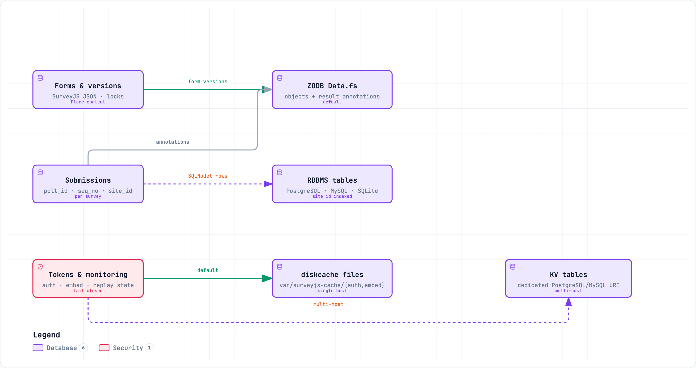

============
Installation
============

This package is a Plone add-on. Installing it has two parts: setting up the
package in a Buildout-based Plone project, and — optionally — building the
external survey validator binary. The toolchain is managed with ``uv``; the
Plone instance itself is still assembled by Buildout.

Prerequisites
=============

* **Plone 6.2** — the version covered by the CI test suite (the test
  configuration ``test_plone60.cfg`` extends the Plone 6.2.x buildout test
  config). Plone 6.1 is not exercised by CI and therefore not advertised as
  supported. Plone 5.2 and its buildout configuration are gone.
* **Python 3.12, 3.13 or 3.14** — downloaded and managed automatically by
  ``uv``. The Plone test suite runs on 3.14; the Plone-free test subset
  (converters, schema, validator wrapper) runs on all three versions in CI.
* **Latest ``uv``** (see https://docs.astral.sh/uv/; the CI pins it via the
  ``astral-sh/setup-uv`` action with ``version: latest``)
* A Buildout-based Plone project
* The Python runtime dependencies — including ``privacyforms.ai`` and
  ``privacyforms.pdf``, which the AI generator and the fillable-PDF features
  need — are declared in the package metadata and installed with the add-on.
  PDF *filling* additionally requires the optional extra
  ``zopyx.surveyjs[pdf]`` (PyMuPDF, dual-licensed AGPL-3.0 or commercial);
  without it the filled-PDF download is refused with an error message.
* Only for the optional validator build: ``bun`` or ``deno`` on the PATH
  (the add-on can also fetch Deno itself, see below)

Setup with uv (recommended)
===========================

The repository is set up with ``uv``-managed virtual environments; the same
recipe works for a fresh checkout and for the development instance:

.. code-block:: shell

    # 1. Create the virtual environment in the repository root
    uv venv --clear

    # 2. Install the pinned toolchain (zc.buildout 5.2, setuptools, …)
    uv pip install -r requirements.txt

    # 3. Run buildout — generates bin/instance, bin/test, bin/zopepy, …
    .venv/bin/buildout

    # 4. Start Plone
    ./bin/instance fg          # foreground
    # or: ./bin/instance start # background
    # or: ./bin/instance stop

The development site root is http://localhost:8082/demo; log in with
``forms`` / ``formsarecool`` (Editor role) or the admin account from the
buildout configuration.

Why uv?

* ``uv pip install`` is dramatically faster than classic pip and uses a
  shared content-addressed cache.
* ``requirements.txt`` pins the buildout toolchain
  (``zc.buildout==5.2.0``, ``setuptools==81.0.0``, …), so buildout runs in
  a reproducible environment regardless of the system Python.
* The same uv-managed environment is used by the Makefile targets
  (``make test``, ``make docs``, ``make sdist``).

Buildout
========

Classic buildout installation of the add-on itself:

1. Add ``zopyx.surveyjs`` to your buildout eggs and rerun buildout.

   .. code-block:: ini

      [buildout]
      eggs +=
          zopyx.surveyjs

2. Restart Plone and install the add-on in the **Add-ons** control panel.

3. The buildout generates the usual scripts: ``bin/instance`` (Plone),
   ``bin/test`` (Plone test runner) and ``bin/zopepy`` (Python interpreter
   with the Zope environment). The Makefile's ``make test`` runs the test
   suite through these scripts with coverage.

Verifying the installation
==========================

Run the test suite to confirm everything is wired up correctly:

.. code-block:: shell

    make test

.. _demo-content-profile:

Demo content profile (optional)
===============================

The add-on ships a second GenericSetup profile, ``zopyx.surveyjs:demo``, that
seeds a ready-to-explore demo setup on an **existing** site. It is an
extension profile, so install the regular add-on first. It is not a separate
entry in the Add-ons control panel; apply it through GenericSetup, either from
the ZMI (``portal_setup`` → *Import* → select ``zopyx.surveyjs:demo``) or with
a script:

.. code-block:: python

    from plone import api

    setup = api.portal.get_tool("portal_setup")
    setup.runAllImportStepsFromProfile("profile-zopyx.surveyjs:demo")

The profile is idempotent — re-running it never duplicates themes, forms or
form versions — and it creates:

* the four SurveyJS theme presets that ``scripts/init_plone.py`` seeds as
  well: ``light``, ``dark``, ``light-no-panels`` and ``dark-no-panels``
  (existing themes with one of these names are left untouched), and
* a published folder ``demo-forms`` with three complex English example forms,
  each covering a different scope and each using a different theme:

  .. list-table::
     :header-rows: 1

     * - Form (id)
       - Scope
       - Theme
     * - Employee Onboarding (``employee-onboarding``)
       - HR onboarding intake: personal data, employment terms, IT
         provisioning, emergency contacts, policies, signature
       - ``light``
     * - Customer Satisfaction Survey (``customer-satisfaction``)
       - Product and support satisfaction: usage profile, ratings, matrices,
         conditional support questions, improvement ranking, renewal intent
       - ``dark``
     * - Conference Registration (``conference-registration``)
       - Event registration: attendee data, tickets with calculated totals,
         payment/billing, session booking, group attendees, dietary and
         accessibility requirements
       - ``light-no-panels``

All three forms are stored with ``Store`` as submission action and are
published, so they can be filled in anonymously. Applying the profile again
after a package upgrade refreshes the shipped form definitions: a form gets a
new version only when its definition actually changed.

This profile is also the example content of the add-on's site distribution, see
:doc:`distribution` for creating a new site that already contains it.

External survey validation (deno / bun)
=======================================

The optional "Force Server Side Validation" feature (per-survey setting,
default on) runs every submission through an external validator binary. The
validator is a single compiled executable built from
``validate.mjs`` (SurveyJS schema checks against ``survey-core`` 3.x), so no
Node.js runtime is needed on the Plone host.

Source layout

The validator lives in ``src/zopyx/surveyjs/data_validation/``:

* ``validate.mjs`` — the validation script (ESM, imports ``survey-core``).
* ``package.json`` / ``bun.lock`` — the ``survey-core@3.0.4`` dependency
  (``npm validate`` / ``bun validate.mjs`` run the script directly).
* ``deno_build.py`` — self-contained build script (downloads the pinned Deno
  release and verifies its SHA256 digest and reported version).
  The pinned Deno version and SHA256 digests for the supported macOS/Linux
  x86_64 and arm64 artifacts are maintained in ``deno_build.py``.
* ``validate_data.py`` — the Python wrapper that locates and invokes the
  binary at submission time.
* ``validate-linux`` / ``validate-mac`` — the runtime binaries the wrapper
  expects (next to the module).

Runtime auto-build (no manual step)

If the binary is missing — or was built from a different ``validate.mjs`` or
toolchain pin — the wrapper builds it
automatically: ``deno_build.py`` downloads the pinned Deno release from
GitHub, verifies the archive SHA256 digest, verifies ``deno --version``, and
then compiles ``validate.mjs`` with an import map
(``npm:survey-core@3.0.4``) and writes ``validate-linux`` (or
``validate-mac``) next to the module. No Deno installation is required on
the Plone host for this path — the script fetches it into a temporary
directory.

The compile passes ``--minimum-dependency-age=0``: Deno 2.9 and newer
otherwise refuse to resolve a package release published less than 24 hours
ago, which would block every deliberate ``survey-core`` pin bump for a day.
The exact pin and the pinned, checksum-verified Deno toolchain remain the
supply-chain boundary.

Manual build with bun (recommended for packaging)

Bun produces smaller, self-contained binaries and is the default in the
included Makefile:

.. code-block:: shell

    cd src/zopyx/surveyjs/data_validation
    bun install                                   # fetch survey-core
    bun build --compile --target=bun-linux-x64 \
        --outfile dist/survey-validate-linux validate.mjs
    # macOS:
    bun build --compile --target=bun-darwin-x64 \
        --outfile dist/survey-validate-macos validate.mjs

    # or simply: make all   (bun install + both targets)

Manual build with deno

.. code-block:: shell

    cd src/zopyx/surveyjs/data_validation
    deno install
    deno compile --allow-read --allow-write --minimum-dependency-age=0 \
        --no-check --node-modules-dir=auto \
        --target=x86_64-unknown-linux-gnu \
        --output dist/survey-validate-linux-deno validate.mjs

    # or simply: make deno  (both macOS and Linux targets)

Cross-compilation

Building a macOS binary from a Linux host (or vice versa) works through the
Docker targets in the Makefile:

.. code-block:: shell

    make docker-linux        # survey-validate-deno:linux image
    make docker-mac-extract  # build macOS binary and copy it out of the image

Deploying the binary

The ``dist/`` directory is for packaging/distribution. At runtime the
wrapper looks for the binary **next to the module**
(``data_validation/validate-linux`` on Linux); copy the freshly built
binary there (or let the auto-build path create it) so server-side
validation is active. Rebuilds are deterministic: the build records a
manifest (``validate-linux.meta.json``) with the ``validate.mjs`` source
hash and the pinned toolchain, and the binary is rebuilt only when those
inputs change — never on a calendar schedule — so the Plone host needs
no build-time network access during submission handling. Before each
run the wrapper verifies the binary's SHA-256 against its provenance
digest (``validate-linux.sha256``), cached once per day; a corrupted or
tampered binary is refused (fail-closed). The validator child runs with
core dumps disabled; memory runaway is contained by subprocess isolation
(a validator OOM kills only the child) and the 30-second validation
timeout. The
downloaded Deno executable is never used unless both its archive digest and
reported version match the pins in ``deno_build.py``. Windows is not currently
supported by the runtime wrapper.

Optional components
===================

         submissions go either to ZODB annotations or to relational tables, and
         the token and monitoring cache uses diskcache files or a dedicated KV
         database

Three data domains, three separate decisions: form versions always stay in
Plone content, submissions use one globally configured backend, and the token
and monitoring cache has its own switch — local ``diskcache`` files on a single
host, a dedicated KV database URI when several hosts must agree.

Relational result storage
  The SQLModel backend supports SQLite, PostgreSQL, and MySQL. Ensure the
  configured database URI is reachable by the Plone process (default:
  ``sqlite:///var/surveyjs-results.db``). Each row stores the Plone
  ``site_id`` to support multi-site deployments. Configure it under
  Site Setup > Forms → Storage.

KV cache backend
  The KV facade used by authenticity tokens, Direct DOM embed tokens and
  monitoring is configured separately under Site Setup > Forms → Storage.
  The default is ``diskcache`` with caches below
  ``$INSTANCE_HOME/var/surveyjs-cache/{auth,embed,monitoring}``. Relative
  paths are resolved against ``INSTANCE_HOME`` rather than the process
  working directory. For multiple application servers, select ``rdbms`` and
  configure ``kv_cache_database_uri`` with a PostgreSQL or MySQL SQLAlchemy
  URI. A dedicated KV URI is required; the result ``database_uri`` is not
  used implicitly. See ``DISKCACHE.md`` for the deployment
  topology, namespace and backend-switch implications.

SurveyJS license and AI parameters
  The SurveyJS license key and the AI model/API key are injected while the
  site is built — from a key file or 1Password (local development) or from
  GitHub secrets (CI/CD Docker build). See :doc:`deployment-secrets`.

AI Generator
  The AI Generator uses the Python ``llm`` package plus the
  ``privacyforms_ai`` helper and supports installed, Ollama and custom
  OpenAI-compatible providers. See :doc:`ai` and :doc:`global-options`.

Source code
===========

The project consists of three repositories under the ``zopyx`` GitHub
organisation. The Plone add-on depends on the two Python packages for its
AI and PDF features:

.. list-table::
   :header-rows: 1

   * - Repository
     - Purpose
   * - `zopyx/zopyx.surveyjs <https://github.com/zopyx/zopyx.surveyjs>`_
     - This add-on: the Plone 6 + SurveyJS integration (forms, results,
       AI generator, chatbot, PDF generator, embedding).
   * - `zopyx/privacyforms.ai <https://github.com/zopyx/privacyforms.ai>`_
     - Python helpers and CLI on top of the ``llm`` library; provides the
       model resolution (installed / Ollama / custom OpenAI-compatible
       endpoints) used by the AI generator. PyPI package:
       ``privacyforms.ai``.
   * - `zopyx/privacyforms.pdf <https://github.com/zopyx/privacyforms.pdf>`_
     - Python library for parsing and filling PDF forms (pypdf-based);
       powers the fillable-PDF import and PDF filling features. PyPI
       package: ``privacyforms.pdf``.

In this repository's buildout the two packages are installed as develop
eggs from the sibling checkouts under ``src/`` (``src/privacyforms.ai``,
``src/privacyforms.pdf``). Issues and contributions are handled in the
respective repository.

Development workflow
====================

* ``make test`` — Plone test runner (``bin/test -s zopyx.surveyjs``) plus
  converter tests with coverage.
* ``make docs`` — builds this documentation with Sphinx in an ephemeral
  ``uv`` environment (no persistent venv needed).
* ``make sdist`` — builds the source distribution via
  ``uv run python setup.py sdist``.
