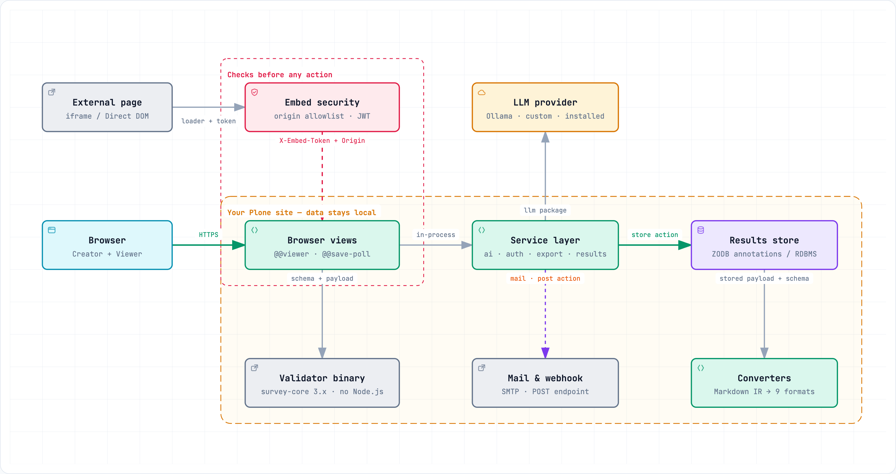

========
Overview
========

``zopyx.surveyjs`` integrates SurveyJS into Plone. It provides a visual form
builder (SurveyJS Creator), a public form viewer, storage for submissions,
export tools, and optional integrations such as mail delivery or POSTing
submissions to external endpoints.

         results store, and the optional external integrations (validator
         binary, LLM provider, mail and POST endpoint)

The browser talks to the add-on's views, which delegate to the service layer
and persist submissions in the configured store. Everything else in that
picture — the validator binary, the LLM provider, mail and the POST endpoint —
is an optional outbound integration and can stay unused.

Key capabilities
================

- SurveyJS Creator-backed form editor stored as JSON.
- Public survey rendering with SurveyJS.
- Configurable actions per Survey (store, mail, notification, POST).
- Multi-format exports: text, Markdown, HTML, PDF, CSV, XLSX, XML, DOCX, JSON.
- Optional server-side validation via an external SurveyJS validator binary
  (per survey, default on).
- Embedding support: iframe embedding and Direct DOM embedding with origin
  allowlists and signed tokens.
- AI Generator for drafting, refining and document-based form creation.
- Chatbot for survey-related questions, backed by the configured LLM.
- Survey templates for starting new surveys from a prepared form.

Core concepts
=============

Survey
  A Plone content item storing the SurveyJS form JSON, submission settings,
  and actions.

Form version
  Every time a form is saved, a new version is stored. The latest version is
  used for rendering and submission validation.

Submission (poll)
  The JSON payload produced by a completed survey. Submissions can be stored,
  exported, mailed, and POSTed to external endpoints.

Actions
  Per-survey behaviors triggered on submission: store, mail, notification,
  and POST.
