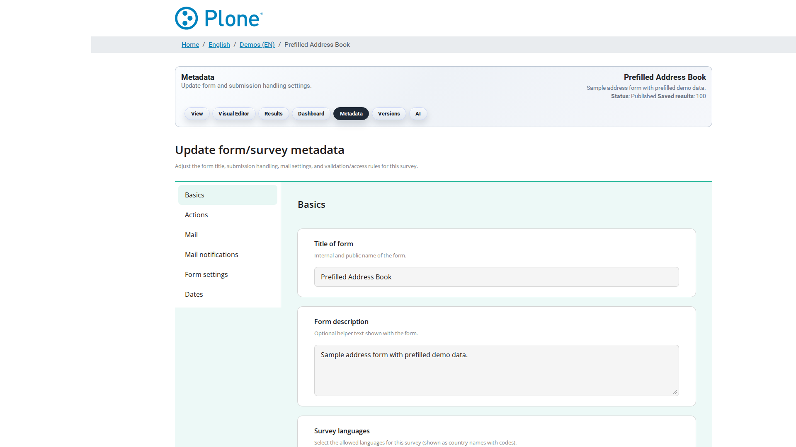
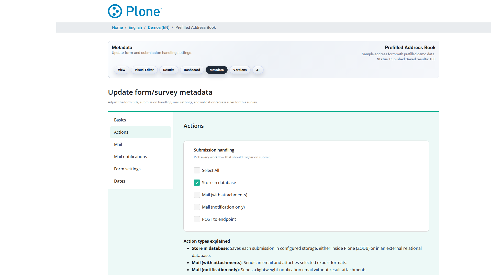
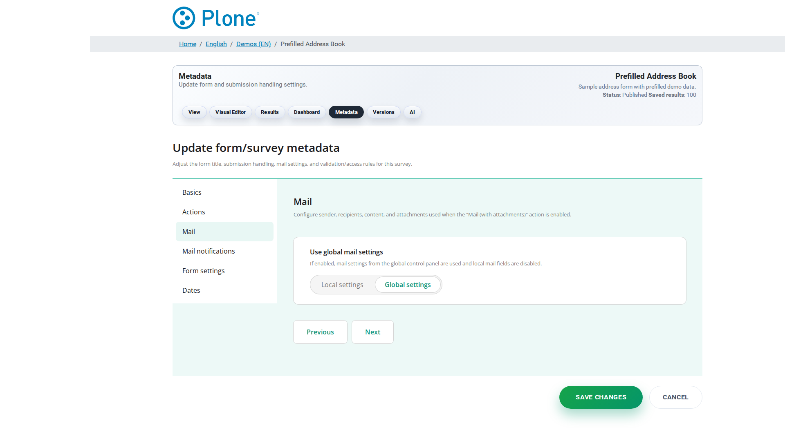
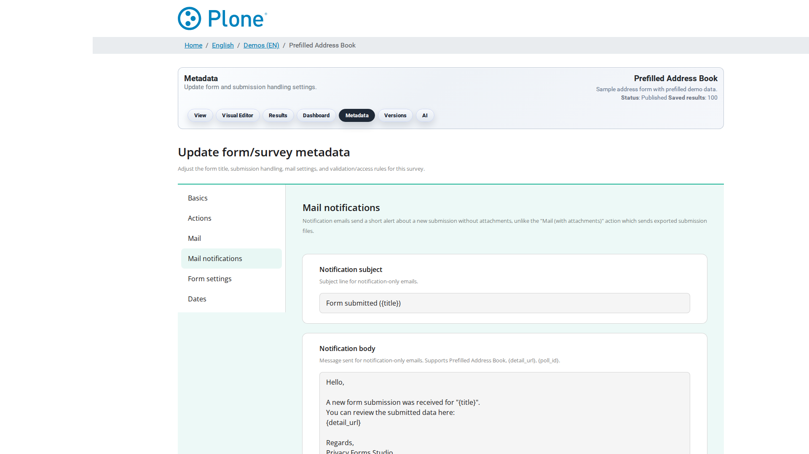
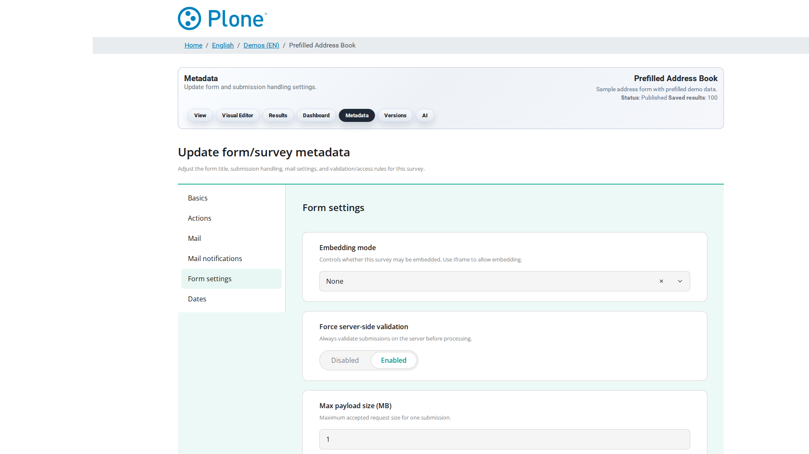

==============
Survey options
==============

These options are stored on the Survey item itself and are edited in the
survey's edit form. They control how this single survey handles submissions,
mails, validation, access, embedding and PDF output. Site-wide defaults live
in the :doc:`global-options`.

Actions
-------

.. list-table::
   :header-rows: 1

   * - Field
     - Type
     - Default
     - Description
   * - Actions
     - Set
     - ``store``
     - Submission handling. Multiple options can be selected at once; every
       selected action runs for each accepted submission. Available options:

       * ``store`` — save the submission in Plone. This is the foundation for
         the results listing, exports and the PDF generator, so it should
         normally stay enabled. The field is mandatory (at least one option
         must be selected) and defaults to ``store``.
       * ``mail`` — e-mail the exported results as attachments. The export
         formats come from the Mail fieldset; the survey must have a
         sender and a recipient configured (or global Mail defaults).
       * ``mail-notification`` — send a notification e-mail **without**
         attachments. Subject and body come from the Mail notifications
         fieldset and may contain placeholders such as ``{title}``,
         ``{detail_url}`` and ``{poll_id}``.
       * ``post`` — forward the submission payload to an HTTP endpoint
         (see POST endpoint URL below). Useful for webhook-style
         integrations with downstream systems.

       Example: ``store`` + ``post`` keeps the submission in Plone *and*
       mirrors it to an external service.
   * - POST endpoint URL
     - URI
     - empty
     - The HTTP(S) endpoint that receives the submission payload when the
       ``post`` action is enabled. The payload is a JSON object with the
       following structure::

           {
             "poll": { ...submission fields..., "poll_id": "…", "created": "…" },
             "form": { ...latest survey JSON schema... },
             "survey_url": "https://example.org/demo/survey-1"
           }

       The request uses a 10 second timeout; delivery failures are logged and
       do **not** block the submission from being stored. If no endpoint is
       configured, the ``post`` action is skipped with a log message.

Mail
----

.. list-table::
   :header-rows: 1

   * - Field
     - Type
     - Default
     - Description
   * - E-Mail sender
     - Text
     - empty
     - Sender address for outgoing mail (e.g. ``no-reply@example.org``).
       Mandatory when the ``mail`` action is selected, unless a global
       default sender is configured in the Forms control panel.
   * - E-Mail recipient
     - Text
     - empty
     - Primary recipient for result exports and notifications. A **single**
       address; use E-Mail CC / E-Mail BCC for additional recipients.
       Mandatory when the ``mail`` action is selected.
   * - Subject
     - Text
     - empty
     - Subject line for result export e-mails. May contain the placeholder
       ``{poll_id}``, which is replaced with the submission id.
   * - E-Mail CC
     - List
     - empty
     - CC recipients for result exports. One address per line. Useful to
       keep stakeholders informed without making them the primary recipient.
   * - E-Mail BCC
     - List
     - empty
     - BCC recipients for result exports. One address per line. BCC keeps
       the recipient list invisible to the other recipients, which is useful
       when mailing to a larger or external audience.
   * - Formats
     - Set
     - empty
     - Export formats attached to result e-mails. Available formats: ``text``,
       ``md``, ``html``, ``pdf``, ``csv``, ``xlsx``, ``xml``, ``docx``,
       ``json``. Multiple formats can be selected; every selected format is
       generated and attached.
   * - Body
     - Text
     - empty
     - Body text of the result export e-mail. Supports the placeholders
       ``{created}`` (submission timestamp), ``{creator}`` (submitting user,
       if known) and ``{formats}`` (the list of attached formats).

Mail notifications
------------------

The Mail notifications fieldset configures the notification e-mail that is
sent when the ``mail-notification`` action is selected. Unlike the ``mail``
action, no result attachments are included — this is meant for lightweight
"something was submitted" notifications.

.. list-table::
   :header-rows: 1

   * - Field
     - Type
     - Default
     - Description
   * - Subject for notifications
     - Text
     - ``Form submitted ({title})``
     - Subject line of the notification e-mail. Supports the placeholders
       ``{title}`` (survey title), ``{detail_url}`` (link to the submission
       detail view) and ``{poll_id}`` (submission id).
   * - Body for notifications
     - Text
     - See default template
     - Body text of the notification e-mail. Supports ``{title}``,
       ``{detail_url}`` and ``{poll_id}``. The default template greets the
       recipient, names the survey and links to the submission detail view;
       replace it with your own text if you need a different wording.

Form Settings
-------------

.. list-table::
   :header-rows: 1

   * - Field
     - Type
     - Default
     - Description
   * - Force Server Side Validation
     - Bool
     - ``true``
     - When enabled (default), every save/submit runs the external SurveyJS
       validator binary (a Deno-based validator, see ``data-validation/``)
       in addition to the client-side JavaScript validation. This gives a
       second, authoritative validation on the server and is the safer choice
       for untrusted input. Disable it only if the validator binary is not
       deployed or if you explicitly want to rely on client-side validation
       alone — keep in mind that client-side validation can be bypassed.
   * - Max size payload (MB)
     - Int
     - ``1``
     - Maximum accepted submission payload size in megabytes. Submissions
       larger than this limit are rejected. The minimum value is 1 MB.
       Increase this for surveys with large file uploads or long text
       answers; keep it low to protect against oversized or malicious
       payloads.
   * - Access mode
     - Choice
     - ``public``
     - Controls who may submit this form:

       * ``public`` — anyone with the URL can view and submit the form.
       * ``trusted`` — a trusted access token must be present in the URL.
         Tokens are generated in the token management view (``@@token-store``)
         and are valid for the configured TTL.
       * ``trusted-tokens`` — like ``trusted``, but each token is
         **single-use**: it is invalidated after the first successful
         submission. Use this for one-time invitation links.
   * - Trusted access token TTL (hours)
     - Int
     - ``168``
     - Lifetime of trusted access tokens in hours (default 168 = 7 days,
       minimum 1). After expiry a token no longer grants access and a new
       token must be generated. Shorter values reduce the window in which a
       leaked token can be abused; longer values reduce the operational
       overhead of regenerating tokens.

Survey languages
----------------

.. list-table::
   :header-rows: 1

   * - Field
     - Type
     - Default
     - Description
   * - Survey languages
     - List
     - empty
     - The languages this survey may be displayed in (language codes with
       English labels, e.g. ``de``, ``en``, ``fr``). Leave empty to allow
       all languages. When languages are restricted, only the listed
       languages are offered to visitors.

Embedding
---------

.. list-table::
   :header-rows: 1

   * - Field
     - Type
     - Default
     - Description
   * - Embedding mode
     - Choice
     - ``none``
     - Whether this survey may be embedded in external websites:

       * ``none`` — embedding is not allowed; the survey runs standalone on
         the Plone site.
       * ``iframe`` — the survey can be embedded via ``<iframe>``. This is
         the recommended and secure option; it requires no further
         configuration.
       * ``direct`` — Direct DOM embedding (experimental): the survey is
         injected directly into the embedding page without an iframe. This
         provides a seamless integration but requires careful origin
         configuration (see below) and the global Direct DOM Embedding
         settings must be enabled.
   * - Allowed origins for direct embedding
     - List
     - empty
     - Origins allowed to embed this survey via Direct DOM. Format:
       ``https://example.com`` (no path, no query string, no trailing
       slash). HTTP is accepted for localhost development only
       (``http://localhost:8000``); production origins must use HTTPS.
       At least one origin is **required** when the embedding mode is
       ``direct``. Up to 10 origins are allowed per survey; the global
       setting "Maximum origins per survey" can lower this limit.
   * - Embed token TTL (seconds)
     - Int
     - ``300``
     - Lifetime of embedding tokens in seconds (range 60–3600). An embed
       token authorizes the embedding page to load the survey; after the
       TTL expires a new token must be issued. Shorter values are safer,
       longer values reduce token churn on frequently visited pages.

PDF Form / Fillable PDF
-----------------------

.. list-table::
   :header-rows: 1

   * - Field
     - Type
     - Default
     - Description
   * - Fillable PDF form
     - File
     - empty
     - Upload a fillable PDF form to enable the PDF-based form workflow for
       this survey: visitors can download the PDF, fill it out, and submit
       it; the submission is then processed like a normal survey
       submission. Leave empty to run the survey as a regular online form.
   * - Fillable PDF template
     - File
     - empty
     - Upload a fillable PDF template that is used for automated PDF
       generation from survey submissions. This powers the "fillable PDF"
       feature, where completed survey data is merged into the template and
       the resulting PDF is delivered as the export artifact.
