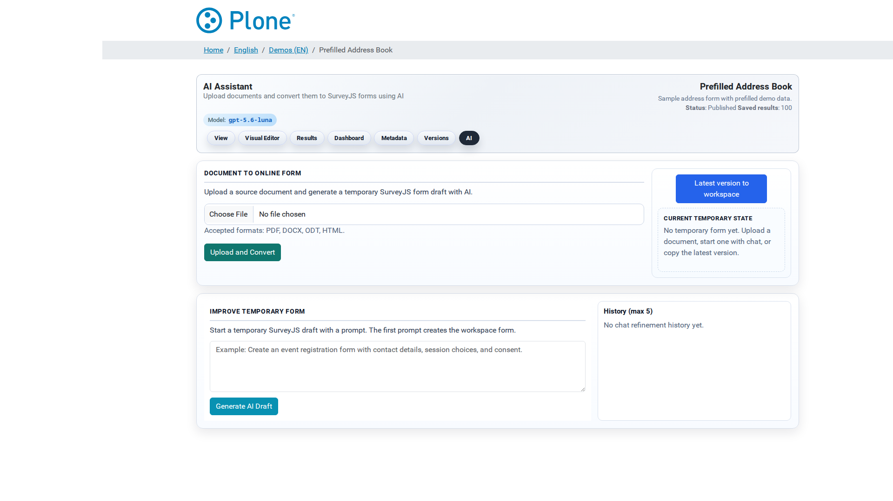

AI Generator
============

The AI generator (``@@ai``) builds SurveyJS forms from natural language.
Describe what you need — "a customer satisfaction survey with 10
questions" — and the AI produces a complete, editable form draft. You can
refine the draft in a chat loop, upload a document to convert (PDF, DOCX,
ODT, HTML), preview the result and finally store it as a new form
version. The published survey is untouched until you explicitly promote
the draft.

How to get here
---------------

* From the survey landing page, click **AI**.
* Directly at ``/my-survey/@@ai``.
* The AI feature must be enabled globally (default: on) and an AI
  provider must be configured (Site Setup > Forms → AI). If no provider is
  configured, the screen explains this instead of offering generation.

What you see
------------

**Survey header** — the shared navigation, the headline "AI Assistant —
Upload documents and convert them to SurveyJS forms using AI", and a
**model badge** showing which LLM is active (e.g. the Ollama model or the
custom model name).

**Document To Online Form** (left panel)

  Upload a source document (``.pdf``, ``.docx``, ``.odt``, ``.html``) and
  click **Upload and Convert** — the AI rebuilds the document as an
  online form. For fillable PDFs the form fields are extracted and mapped
  into the generated survey.

**Action pane** (right panel)

  * **Latest version to workspace** — copies the survey's current active
    form into the temporary workspace. This is the recommended starting
    point for refinements: you improve the existing form instead of
    starting from zero.
  * **Clear workspace** — discards the draft and its history. There is no
    undo.
  * **Preview form** — opens the draft in a SurveyJS preview modal, so
    you can test it before storing.
  * **Store as new version** — promotes the draft: it becomes a new form
    version and the active form of the survey. The workspace is cleared.

  Below the buttons, the **Current Temporary State** box tells you whether
  a draft exists and what you can do with it.

**Improve Temporary Form** (chat section)

  A prompt textarea plus a submit button. With an empty workspace the
  button reads **Generate AI Draft** (creates the first draft); with an
  existing draft it reads **Apply AI Change** (returns the full updated
  form). Example prompts are shown as placeholders (create an event
  registration form; add a contact-preferences section and make e-mail
  required).

**History (max 5)** (right of the chat)

  The last five refinement steps, each showing how many steps back it is
  and the prompt that produced it. Use the **revert** button to restore a
  previous state; the **delete** button (on the newest entry) removes it.

What you can do
---------------

Generate a new form from scratch
~~~~~~~~~~~~~~~~~~~~~~~~~~~~~~~~

1. Open ``@@ai``.
2. Type a prompt into the chat field: describe the purpose, the sections
   and any requirements (question types, required fields, languages).
3. Click **Generate AI Draft**.
4. Preview the result, refine it further, then store it.

Refine the existing form
~~~~~~~~~~~~~~~~~~~~~~~~

1. Click **Latest version to workspace** — the current form becomes the
   working draft.
2. Describe the change ("change the rating questions from 1–5 to 1–10 and
   make the e-mail field required").
3. Click **Apply AI Change**. Each prompt builds on the latest draft; the
   previous states are kept in the history for reverting.
4. Preview, iterate, and finally **Store as new version**.

Convert a document
~~~~~~~~~~~~~~~~~~

1. Upload a PDF, DOCX, ODT or HTML file.
2. Click **Upload and Convert**. The AI rebuilds the document's structure
   (grouping, section order, tables) as an online form; fillable PDF
   fields are mapped to survey questions.
3. Review the draft in the preview, refine with chat prompts if needed,
   then store it as a version.

Promote the draft
~~~~~~~~~~~~~~~~~

* **Store as new version** makes the draft the survey's active form. The
  change is visible immediately in the viewer; the version history keeps
  the previous versions (see :doc:`ui-form-versions`).

Tips & notes
------------

* **The workspace is separate and per survey** — drafts live in a
  temporary area, not in the version history. Promote drafts you want to
  keep; **Clear workspace** removes them permanently.
* **Good prompts make good forms** — mention the question types, the
  required fields and the tone. The global "Prompt before / Prompt after"
  settings (Site Setup > Forms → AI) add site-wide rules to every
  generation.
* **Larger models produce structurally better forms** but are slower and
  costlier; start with the provider default.
* **AI output is a draft** — always preview and check the result before
  storing it as the live form. The editor remains the tool for fine
  adjustments after AI generation.
* If generation fails with an invalid-JSON error, retry or simplify the
  request; a model that is too weak is the usual cause (see the
  troubleshooting section in :doc:`ai`).

Related documentation
---------------------

* :doc:`ai` — how the generator works (prompt pipeline, providers,
  document conversion, troubleshooting).
* :doc:`global-options` — the AI provider settings (installed / Ollama /
  custom, API keys, prompts).
* :doc:`ui-editor` — fine-tuning the stored form by hand.
* :doc:`ui-form-versions` — where promoted drafts land.
