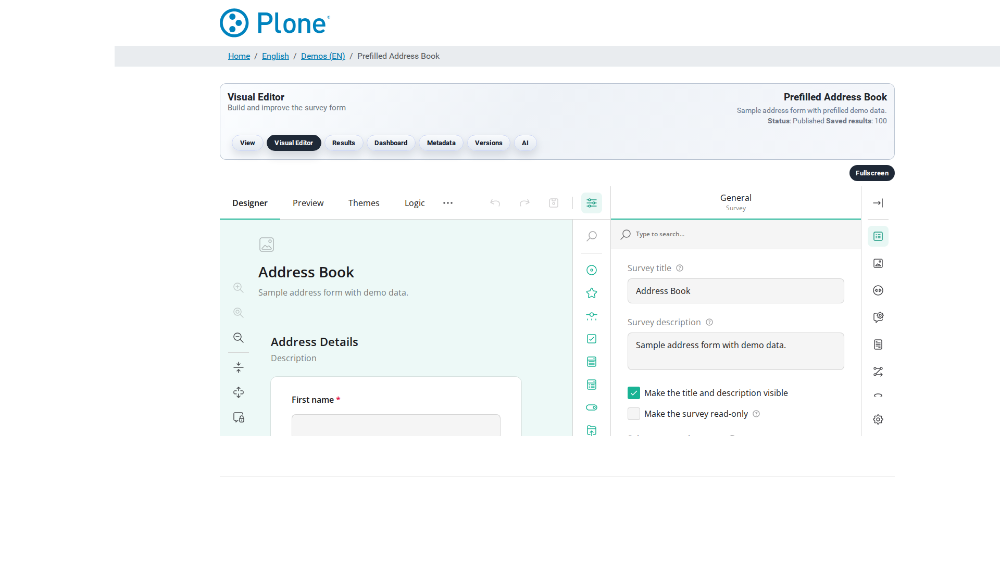

Editor (``@@editor``)
=====================

The SurveyJS Creator visual editor: drag question types onto the page,
configure validation and logic, preview — every save creates a new form
version (see :doc:`survey-options` for the settings).

