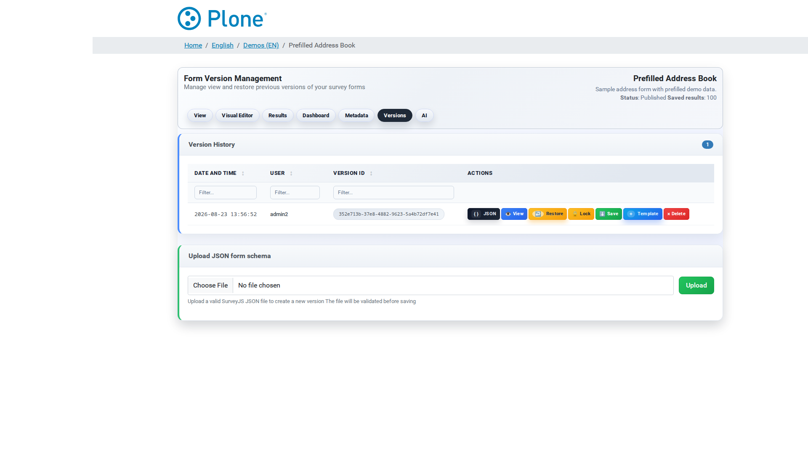

Form Versions (``@@form-versions``)
===================================

Every save creates a new form version. This screen lists them and lets you
preview, restore, lock, download or upload versions (see :doc:`endpoints`
for the underlying operations).

