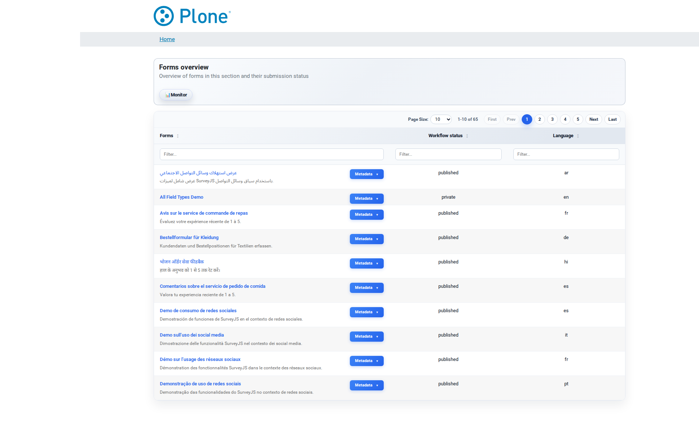

Forms Overview
==============

The forms overview (``@@pfs``) is the entry point of Privacy Forms Studio.
It is a role-aware start page that lists the actions you are allowed to
take: create a new form, open the management overviews, or start from a
prepared template. Instead of a plain list of surveys it offers prominent
**action cards**, so the page works as a guided launcher for both
occasional authors and daily operators.

How to get here
---------------

* The site root redirects to the forms overview automatically
  (``@@root-redirect``), so visiting ``/`` lands here.
* You can open it directly at ``/@@pfs`` (folder view of the Plone site).
* The overview is available to **logged-in users**; anonymous visitors see
  an empty state with a sign-in link instead.

What you see
------------

The page is built from a hero section and a grid of cards. Which cards
appear depends on your role:

**Hero**

  The headline "Select an action" with a short explanation. It frames the
  page as a launcher: choose the guided action that fits what you want to
  do.

**Cards**

  * **New form/survey** — starts the creation wizard (``@@survey-add``).
    Shown when you may add SurveyJS content (``AddSurvey`` permission).
  * **Create from template** — pick a prepared template from a searchable
    dropdown and create a new survey from it in one step. Shown when
    templates exist and you may add surveys.
  * **Forms overview** — opens the management listing of all surveys
    (``@@survey-overview``). Shown to managers.
  * **Templates overview** — lists the saved templates
    (``@@survey-templates-overview``). Shown to managers when templates
    exist.
  * **Submission Monitor** — real-time submission statistics and graphs
    (``@@survey-monitor``). Shown to managers.
  * **Administration** — opens the global Forms control panel
    (``@@forms-settings``) for site-wide settings. Shown to managers.

**Empty state**

  If you have no permission to create content and are not a manager, the
  page explains that no actions are available and offers the sign-in link.
  This is normal for a read-only account.

What you can do
---------------

Create a new survey
~~~~~~~~~~~~~~~~~~~

1. Click the **New form/survey** card.
2. Follow the creation wizard (see below): enter a title, choose the
   languages and the basic settings.
3. The survey appears in the forms overview and is ready for editing.

Create a survey from a template
~~~~~~~~~~~~~~~~~~~~~~~~~~~~~~~

1. In the **Create from template** card, type into the search field to
   filter the template list (or use the native dropdown).
2. Select a template.
3. Click **Create form**. The new survey is created next to the template
   in the current workspace, pre-filled with the template's form
   definition and settings.

   Templates are copies: later changes to the template do not affect the
   survey you created. See :doc:`templates` for the full template
   workflow.

Jump into management
~~~~~~~~~~~~~~~~~~~~

* **Forms overview** (``@@survey-overview``) — the management table of all
  surveys; useful for finding, sorting and opening surveys.
* **Templates overview** — browse the template pool.
* **Submission Monitor** — watch submission rates and usage across all
  surveys.
* **Administration** — the global control panel (Site Setup > Forms).

Tips & notes
------------

* The card set adapts to your permissions — you only ever see actions you
  can actually perform. If a card is missing, your account lacks the
  corresponding permission (ask a site manager).
* The page is the recommended hub for day-to-day work: create from a
  template when you want a standardized start, use the wizard when you
  build from scratch.
* The "Create from template" form submits to the same page (POST); the
  new survey is created in the current folder.

Related documentation
---------------------

* :doc:`quick-start` — the five-step end-user workflow.
* :doc:`ui-survey-landing` — what you see once a survey is opened.
* :doc:`templates` — creating and using survey templates.
* :doc:`views` — the full view reference (including the manager-only
  overviews).
