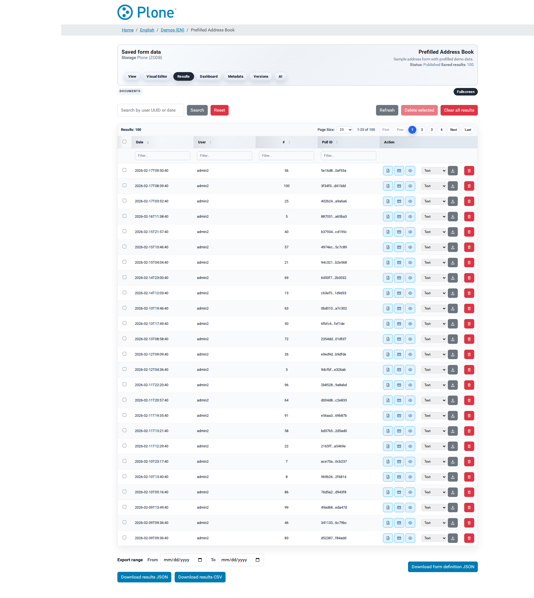

Results
=======

The results view (``@@results``) is the workhorse of the results
workflow: a searchable, filterable table of every stored submission, with
per-row actions (inspect, export, mail, re-POST, delete) and bulk
operations (export everything, clear everything). It is the place to
answer "what did people answer?" — and to get the data out of the system.

How to get here
---------------

* From the survey landing page, click **Results**.
* Directly at ``/my-survey/@@results``.
* The view requires the *Modify portal content* permission (Editor role
  or higher).
* The screen header shows which **storage backend** is in use (ZODB or
  relational database).

What you see
------------

**Survey header** — the shared navigation with the headline "Stored form
data" and the storage backend in the subtitle.

**Storage warning** — when the survey's ``store`` action is disabled, a
banner explains that results are not being saved; the table stays empty.
Enable the action in the survey settings to collect results.

**Toolbar**

  * **Search** — free-text search across user, UUID and date; **Search**
    executes, **Reset** clears the filter.
  * **Refresh** — reloads the data.
  * **Delete selected** — removes all selected rows at once (Managers
    only; the checkbox column is visible to them).
  * **Clear all results** — deletes *everything*; the confirmation dialog
    requires typing ``clear`` to proceed. There is no undo.

**Grid**

  A table (Tabulator) with columns for date, user, sequence number and
  poll id, plus the per-row action buttons. Large result sets are
  paginated; the pager row above the grid shows the total count.

**Per-row actions**

  * **JSON** — the raw submission payload in a modal.
  * **Table** — the payload rendered as a readable table; question labels
    come from the current form schema.
  * **Details** — the full HTML detail page (``@@result-detail``).
  * **Download** — export this single submission in a selectable format.
  * **Mail** — e-mail this submission as an export attachment (only shown
    when the survey has the ``mail`` action).
  * **POST** — re-forward this submission to the survey's POST endpoint
    (only shown when the ``post`` action and an endpoint are configured).
  * **Delete** — remove this single submission (Managers only).

**Export row** (footer)

  * **Export range** — optional ``From`` / ``To`` date filter for the
    bulk downloads (a warning appears if "To" is before "From").
  * **Download results (JSON)** — all submissions with metadata
    (``poll_id``, ``created``, ``user``, ``form_version``).
  * **Download results (CSV)** — the same data as a spreadsheet-friendly
    table, one column per answer field.
  * **Download form definition (JSON)** — the current form schema
    (independent of the results).

What you can do
---------------

Find a submission
~~~~~~~~~~~~~~~~~

1. Type into the **Search** field (user, UUID, date) and click **Search**.
2. Browse the grid; use the pager for large result sets.
3. **Reset** to start over.

Inspect a submission
~~~~~~~~~~~~~~~~~~~~

* Click **Table** for a readable rendering of the answers (matrix
  questions as nested tables).
* Click **Details** for the full detail page with the available export
  formats.
* Click **JSON** for the raw payload — the exact data as stored.

Export data
~~~~~~~~~~~

* **Single submission** — use **Download** on the row and pick a format.
* **All results** — set the optional date range and use **Download
  results (JSON)** or **(CSV)**. JSON is the recommended machine-readable
  format; CSV is for spreadsheet analysis.
* **The form definition** — use **Download form definition (JSON)** to
  archive the schema alongside the data.

Forward a submission
~~~~~~~~~~~~~~~~~~~~

* **Mail** — e-mails the submission as an export attachment using the
  survey's mail settings (see :doc:`actions`).
* **POST** — re-sends the submission to the webhook endpoint with the
  standard payload (see :doc:`exports`).

Delete data
~~~~~~~~~~~

* **Single row** — the **Delete** action (Manager; confirmation dialog).
* **Selected rows** — select the checkboxes and click **Delete selected**
  (Manager).
* **Everything** — **Clear all results** and confirm by typing ``clear``.
  This is permanent — there is no undo.

Tips & notes
------------

* Results are **per survey**; the storage backend is a global setting
  (Site Setup > Forms → Storage).
* Each stored submission carries a per-survey, monotonically increasing
  **sequence number** — a stable reference for cross-referencing with
  external systems.
* The stored record also contains the **form version** the submission was
  made against — useful when the form changed over time.
* If IP addresses / user agents are logged globally, they are stored
  alongside the submission (privacy-relevant — see :doc:`global-options`).
* The full endpoint reference (parameters, error codes, download
  filenames) is in :doc:`endpoints`.

Related documentation
---------------------

* :doc:`exports` — formats, conversion pipeline, detail view, mail and
  POST exports, deletion.
* :doc:`actions` — the actions that decide whether results are stored at
  all.
* :doc:`survey-options` — the Mail/POST settings behind the row actions.
* :doc:`ui-dashboard` — the at-a-glance chart view of the same data.
