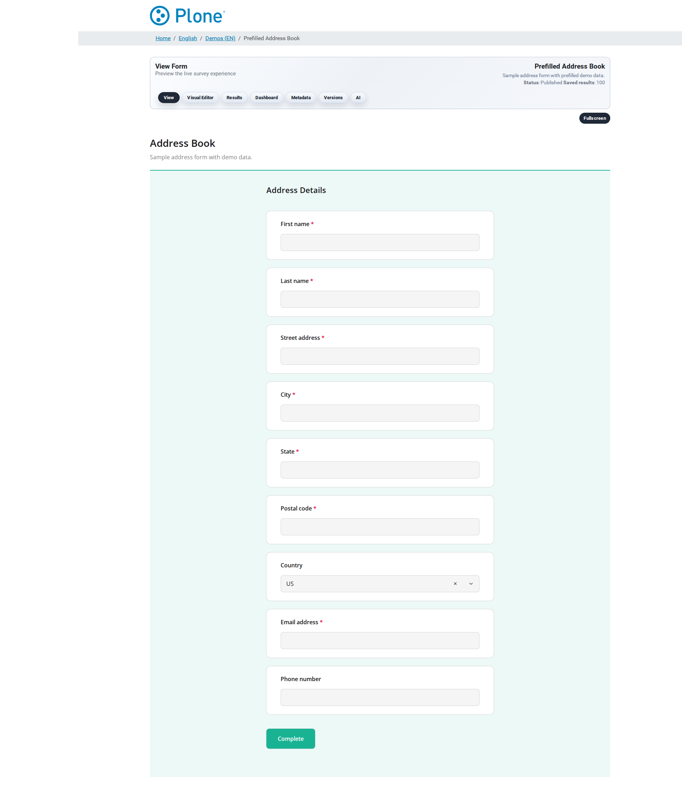

Public Viewer
=============

The public face of the survey (``@@viewer``): renders the form for
visitors, handles the submission and applies the survey's access mode and
token protection. The same view is used for anonymous visitors and
logged-in submitters.

.. image:: _static/screenshots/survey-viewer-anonymous.png
   :align: center
   :alt: Public survey viewer as seen by an anonymous visitor
